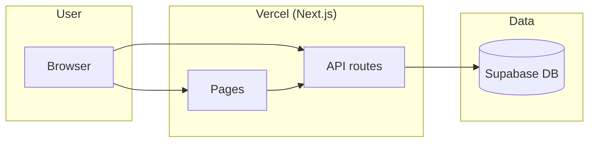
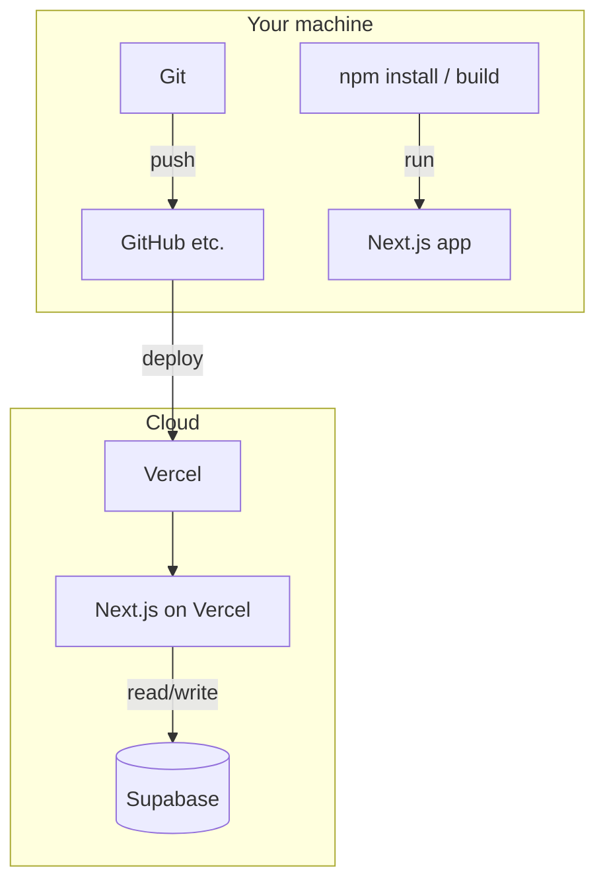
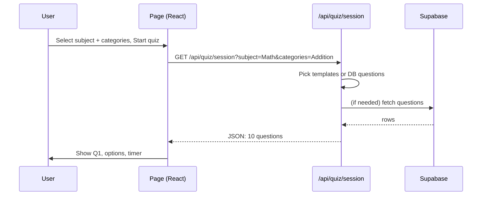
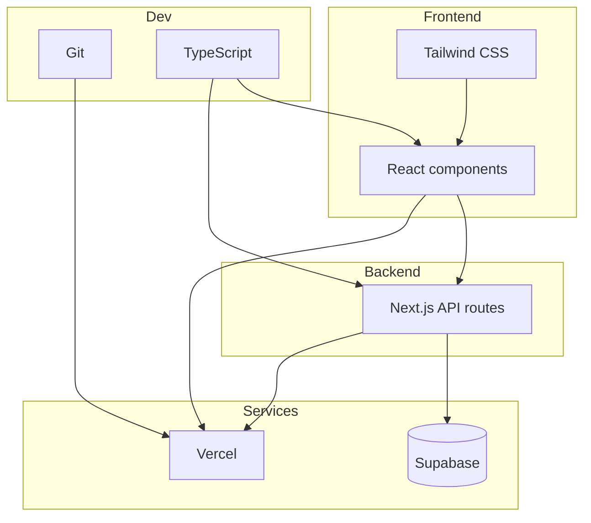

# What We Built – Macro & Micro (with diagrams)

Short, diagram-first overview of the platform: what we use, why, and alternatives.

---

## 1. Macro: System overview

```
┌─────────────────────────────────────────────────────────────────────────┐
│                           USER (browser)                                  │
└────────────────────────────────┬────────────────────────────────────────┘
                                  │
                                  ▼
┌─────────────────────────────────────────────────────────────────────────┐
│  VERCEL (hosting)                                                        │
│  ┌───────────────────────────────────────────────────────────────────┐  │
│  │  NEXT.JS APP (React + API routes)                                  │  │
│  │  • Pages (Subject pick → Category pick → Quiz → Progress)           │  │
│  │  • API routes: /api/quiz/session, /api/quiz/categories,             │  │
│  │               /api/progress, /api/admin/*                           │  │
│  └───────────────────────────────────────────────────────────────────┘  │
└────────────────────────────────┬────────────────────────────────────────┘
                                  │
          ┌───────────────────────┼───────────────────────┐
          ▼                       ▼                       ▼
┌─────────────────┐    ┌─────────────────────┐    ┌─────────────────┐
│  GIT (GitHub)   │    │  SUPABASE           │    │  Local / Env    │
│  • Code repo    │    │  • questions table  │    │  • .env.local   │
│  • Version      │    │  • quiz_progress    │    │  • API keys     │
│    control      │    │  • Auth (optional)  │    │                 │
└─────────────────┘    └─────────────────────┘    └─────────────────┘
```

---

## 2. What we used → Why → Alternatives

| We used | What it is | Why we used it | Other options |
|--------|------------|----------------|----------------|
| **Vercel** | Hosting + serverless for the web app | Deploy Next.js easily, free tier, auto deploy from Git | Netlify, Railway, AWS Amplify, self-host (VPS) |
| **Git** | Version control for code | Track changes, collaborate, rollback, deploy from a branch | None for “version control” (Git is standard); hosting: GitHub, GitLab, Bitbucket |
| **Supabase** | Backend-as-a-Service (DB + APIs) | PostgreSQL DB in the cloud, REST/API, free tier, no server to manage | Firebase, PlanetScale, Neon, Aiven, self-hosted PostgreSQL |
| **Next.js** | React framework (pages + API) | One repo for UI and API, good DX, works great on Vercel | Remix, Nuxt (Vue), SvelteKit, plain React + Express |
| **TypeScript** | Typed JavaScript | Fewer bugs, better editor help | JavaScript only |
| **Tailwind CSS** | Utility CSS framework | Fast styling, no separate CSS files | Plain CSS, styled-components, Chakra, MUI |
| **React** | UI library | Components, state, big ecosystem | Vue, Svelte, Angular |

---

## 3. Macro: Data flow (one picture)



**In words:** Browser talks to Next.js (on Vercel). Next.js pages render UI; API routes read/write Supabase. No direct browser → DB.

---

## 4. Why this combo?

| Goal | How we did it |
|------|----------------|
| Put the app on the internet | Vercel runs the app and gives a URL |
| Save questions & progress | Supabase stores them in a DB |
| Update app without losing history | Git keeps history; Vercel deploys from Git |
| One codebase for UI + backend | Next.js = React + API routes in one project |

---

## 5. Micro: Tech roles (diagram)



- **Git**: code lives in a repo; you push to GitHub (or similar).
- **Vercel**: pulls from the repo and runs the Next.js app in the cloud.
- **Supabase**: the app (on Vercel) connects to Supabase to load questions and save progress.

---

## 6. Micro: Quiz flow (what happens when you “Start quiz”)



Same idea for **Progress**: page calls `/api/progress` → API reads/writes Supabase → returns data to the page.

---

## 7. Alternatives at a glance

| Layer | We use | Alternatives (short) |
|-------|--------|----------------------|
| Hosting | Vercel | Netlify, Railway, Fly.io, AWS, VPS |
| Database | Supabase | Firebase, PlanetScale, Neon, MongoDB Atlas, PostgreSQL on a server |
| Version control | Git (+ GitHub) | GitLab, Bitbucket (all use Git) |
| Front-end | React (Next.js) | Vue (Nuxt), Svelte (SvelteKit), Angular |
| Styling | Tailwind | Plain CSS, Bootstrap, Chakra, MUI |

---

## 8. One-page “stack” diagram



---

## 9. Summary

- **Macro:** Browser → Vercel (Next.js) → Supabase. Git holds code; Vercel deploys from Git.
- **Micro:** Next.js = React (UI) + API routes (server). API routes talk to Supabase. TypeScript + Tailwind for code and styling.
- **Why each:** Vercel = easy deploy; Supabase = DB without managing a server; Git = history and safe deploys; Next.js = one app for UI and API.
- **Alternatives:** Different hosts (Netlify, Railway), different DBs (Firebase, PlanetScale), same idea: app in cloud, DB in cloud, code in Git.

If you want to go deeper on one part (e.g. only Supabase, or only “from Git to Vercel”), say which and we can do a single-page “micro” doc for that.
